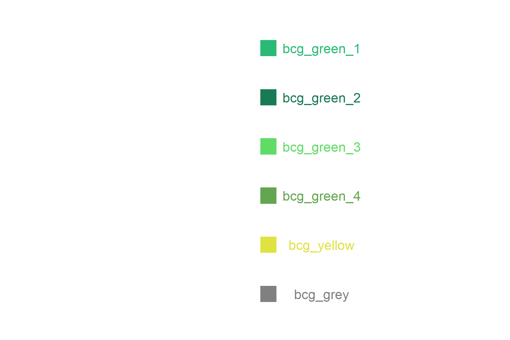

```{r setup, include = FALSE}
knitr::opts_chunk$set(
  collapse = TRUE,
  comment = "#>",
  fig.height = 4,
  fig.width = 6
)
library(tidyverse)
library(bcggtheme)

```

## Using the package

This vignette explains how to use `bcggtheme` to apply BCG-style chart formatting to charts made in `R` using `ggplot`.

`bcggtheme` allows for two different chart styles: classic and modern.

### BCG Classic

For example, using the in-built `iris` dataset:

```{r}
plot <- ggplot(iris,
               aes(x = Sepal.Length,
                   y = Sepal.Width,
                   colour = Species)) +
        geom_point(size = 4) +
        labs(x = "Species",
             y = "",
             colour = "Species")
```

```{r, echo = FALSE}
plot
```


Then we can add the overlaying theme, using `bcg_theme_classic`. This changes the font, font size, axes, and labels.

```{r}
plot +
  bcg_theme_classic()

```

Then change the y scale with `bcg_scale_y_continuous()`. This gets rid of the gap where the y axis joins the x axis:

```{r}
plot +
  bcg_theme_classic() +
  bcg_scale_y_continuous()

```

Finally, adjust the colours using `bcg_colour_manual`:
```{r}
plot +
  bcg_theme_classic() +
  bcg_scale_y_continuous() +
  bcg_colour_manual()

```


### BCG Modern

This works best for bar charts, as will be explained later. Starting with a made-up data set:

```{r}
data <- tribble(~person, ~citations, ~school,
                "Summers", 156191, "Harvard",
                "Duflo", 65808, "MIT",
                "Pakes", 39414, "Harvard",) %>% 
  mutate(person = fct_reorder(person, citations))

plot <- ggplot(data,
               aes(x = person,
                   y = citations,
                   fill = school)) +
        geom_col() +
        labs(x = "Economist",
             y = "",
             colour = "School")
```

```{r, echo = FALSE}
plot
```


Then we can add the overlaying theme, using `bcg_theme_modern`. The default option removes the y axis, and removes all axis tick marks

```{r}
plot +
  bcg_theme_modern()

```

Then we can add the other bells-and-whistles as before, noting that the relevant colour function for is `bcg_fill_manual`.


```{r}
plot +
  bcg_theme_modern() +
  bcg_scale_y_continuous() +
  bcg_fill_manual()

```

Clearly this chart isn't very useful, because we don't know anything about the actual magnitude of citations for each economist. The way around this is to add in labels. We do this using `bcg_geom_label`, which adds standard grey box labels at the top of each bar. You will then have to use `nudge_y` to move the box up a little bit. 


```{r}
plot +
  bcg_theme_modern() +
  bcg_scale_y_continuous(limits = c(0,200000)) +
  bcg_fill_manual() +
  bcg_geom_label(aes(label = scales::comma(citations)), nudge_y = 10000)

```

With the modern version we can add the y axis line back in, using `bcg_theme_modern(y_axis = TRUE)`. However, this doesn't come with the values.

```{r}
plot +
  bcg_theme_modern(y_axis = TRUE) +
  bcg_scale_y_continuous(limits = c(0,200000)) +
  bcg_fill_manual() +
  bcg_geom_label(aes(label = scales::comma(citations)), nudge_y = 10000)

```

### Colours

The package is loaded with 6 standard colours. Both `bcg_colour_manual` and `bcg_fill_manual` choose colours in the following order, from top to bottom.

```{r, out.width = "750px", echo = FALSE}

```

### Outputting charts from R

There are two functions to output charts: `bcg_save` and `bcg_save_pptx`. They automatically save the last object created through ggplot. Both output charts in either a half-slide (designed to fit two charts onto one powerpoint slide) or full-slide (designed to fill up a whole powerpoint slide). 

The following code would create a folder called `test` within the working directory, with two png charts contained within

```{r eval = FALSE}
bcg_save(filename = "test.png", type = "halfslide") # Creates just a half slide
bcg_save(filename = "test.png", type = "fullslide") # Creates just a full slide
bcg_save(filename = "test.png", type = "all") # Creates both 
```

The following code would create a folder called `test` within the working directory, with two pptx charts contained within. The powerpoint slides contain editable graphics, which can be easily copied across to your desired presentation.

```{r eval = FALSE}
bcg_save_pptx(filename = "test.pptx", type = "halfslide") # Creates just a half slide
bcg_save_pptx(filename = "test.pptx", type = "fullslide") # Creates just a full slide
bcg_save_pptx(filename = "test.pptx", type = "all") # Creates both 
```


