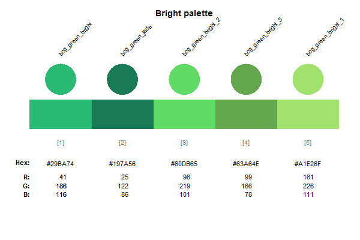
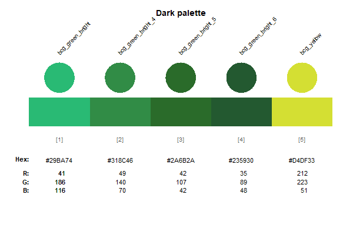
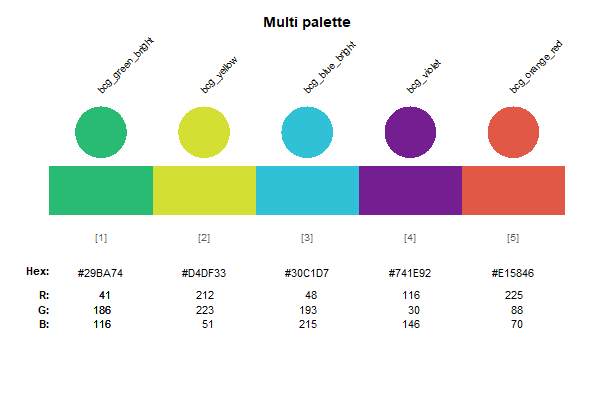
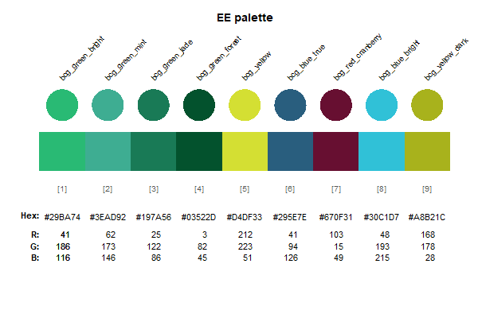
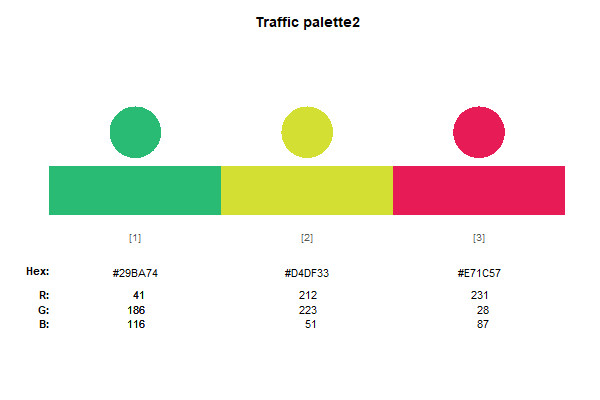

```{r setup, include = FALSE}
knitr::opts_chunk$set(
  collapse = TRUE,
  comment = "#>",
  fig.height = 4,
  fig.width = 6,
  dev = "cairo_pdf"
)

library(tidyverse)
library(bcggtheme)
library(unikn)
library(scales)
```

## Using the package

This vignette explains how to use `bcggtheme` to apply BCG-style chart formatting to charts made in `R` using `ggplot`.

Download `bcggtheme` using

`devtools::install_github("Tony-Chen-Melbourne/bcggtheme")`

After downloading the package, there is one more step required before it will work. The base font in the package is MS Trebuchet, which needs to be loaded into R. This can be done using the `extrafont` package.

`install.packages(extrafont)`
`extrafont::font_import()`

This will take a few minutes to do its thing, after which you're good to go. The import only needs to be done once, after which bcggtheme takes care of the rest.

`bcggtheme` allows for two different chart styles: classic and modern.

### BCG Classic

For example, using the in-built `iris` dataset:

```{r base_create}
plot <- ggplot(iris,
               aes(x = Sepal.Length,
                   y = Sepal.Width,
                   colour = Species)) +
        geom_point(size = 4) +
        labs(x = "Species",
             y = "",
             colour = "Species")
```

```{r base_plot, echo = FALSE}
plot
```


Then we can add the overlaying theme, using `bcg_theme_classic`. This changes the font, font size, axes, and labels.

```{r}
plot +
  bcg_theme_classic()

```

Then change the y scale with `bcg_scale_y_continuous()`. This gets rid of the gap where the y axis joins the x axis:

```{r}
plot +
  bcg_theme_classic() +
  bcg_scale_y_continuous()

```

Finally, adjust the colours using `bcg_colour_manual`:
```{r}
plot +
  bcg_theme_classic() +
  bcg_scale_y_continuous() +
  bcg_colour_manual()

```

The standard background colour for `bcggtheme` is white. In order to get the background the same grey colour as a BCG key message, use `bcg_theme_classic(background = "grey)`

```{r}
plot +
  bcg_theme_classic(background = "grey") +
  bcg_scale_y_continuous() +
  bcg_colour_manual()
```

### BCG Modern

This works best for bar charts, as will be explained later. Starting with a made-up data set:

```{r modern}
data <- tribble(~person, ~citations, ~school,
                "Summers", 156191, "Harvard",
                "Duflo", 65808, "MIT",
                "Pakes", 39414, "Harvard",) %>% 
  mutate(person = fct_reorder(person, citations))

plot <- ggplot(data,
               aes(x = person,
                   y = citations,
                   fill = school)) +
        geom_col() +
        labs(x = "Economist",
             y = "",
             subtitle = "Citations",
             colour = "School")
```

```{r, echo = FALSE}
plot
```


Then we can add the overlaying theme, using `bcg_theme_modern`. The default option removes the y axis, and removes all axis tick marks

```{r}
plot +
  bcg_theme_modern(legend = "right")

```

Then we can add the other bells-and-whistles as before, noting that the relevant colour function for is `bcg_fill_manual`.


```{r}
plot +
  bcg_theme_modern(legend = "right") +
  bcg_scale_y_continuous() +
  bcg_fill_manual()

```

Clearly this chart isn't very useful, because we don't know anything about the actual magnitude of citations for each economist. The way around this is to add in labels. We do this using `bcg_geom_label`, which adds standard grey box labels at the top of each bar. You will then have to use `nudge_y` to move the box up a little bit. 


```{r}
plot +
  bcg_theme_modern(legend = "right") +
  bcg_scale_y_continuous(limits = c(0,200000)) +
  bcg_fill_manual() +
  bcg_geom_label(aes(label = scales::comma(citations)), nudge_y = 20000)

```

With the modern version we can add the y axis line back in, using `bcg_theme_modern(y_axis = TRUE)`.

```{r}
plot +
  bcg_theme_modern(legend = "right", y_axis = TRUE) +
  bcg_scale_y_continuous(limits = c(0,200000)) +
  bcg_fill_manual() +
  bcg_geom_label(aes(label = scales::comma(citations)), nudge_y = 20000)

```


### Flipped charts

`bcggtheme` has the function to remove the x, so that charts make sense when used in conjunction with `coord_flip()`.

```{r}
plot +
  bcg_theme_modern(legend = "right", y_axis = TRUE, background = "grey") +
  bcg_scale_y_continuous(limits = c(0,200000)) +
  bcg_fill_manual() +
  bcg_geom_label(aes(label = scales::comma(citations)), nudge_y = 20000) +
  coord_flip()

```

Then setting  `bcg_theme_modern(flipped = TRUE)`

```{r modern_flipped}
plot +
  bcg_theme_modern(legend = "right",
                   y_axis = TRUE,
                   background = "grey",
                   flipped = TRUE) +
  bcg_scale_y_continuous(limits = c(0,200000)) +
  bcg_fill_manual() +
  bcg_geom_label(aes(label = scales::comma(citations)), nudge_y = 20000) +
  coord_flip()

```

Note that the same functionality applies to `bcg_theme_classic()`.

### Colours

The package is loaded with most standard BCG colours. Colours and palettes are tedious to add, so it's a work in progress and some may be missing. The colours are divided across three palettes: `bright`, `dark`, `ee`, `multi`, `traffic` (picking colours from left to right). 

`bcg_colour_manual` and `bcg_fill_manual` can any choice by specifying `pal = "X"`. The default option is `pal = bright`. The colouring order can also be reversed using the `reverse = TRUE`.
<p>










<p>

### Outputting charts from R

There are two functions to output charts: `bcg_save` and `bcg_save_pptx`. They automatically save the last object created through ggplot.

Both output charts in up to 5 formats:

- "third": 11 cm width $\times$ 14cm height
- "half": 14 cm width $\times$ 14cm height
- "two third": 18 cm width $\times$ 14cm height
- "large": 24 cm width $\times$ 14cm height
- "full": 30 cm width $\times$ 14cm height

These sizes are designed to replicate the options available in ThinkCell.

`bcg_save` and `bcg_save_pptx` can save any one of these formats through `type = "chosen format"`. Alternatively, all five formats can be saved by setting `type = "all"`.

For example, the following code would create a folder called `test` within the working directory, with the relevant png charts contained within

```{r eval = FALSE}
bcg_save(filename = "test.png", type = "third") # Creates just a third slide
bcg_save(filename = "test.png", type = "all") # Creates all five types
```

The following code would create a folder called `test` within the working directory, with the relevant pptx charts contained within. The powerpoint slides contain editable graphics, which can be easily copied across to your desired presentation.

```{r eval = FALSE}
bcg_save_pptx(filename = "test.pptx", type = "half") # Creates just a half slide
bcg_save_pptx(filename = "test.pptx", type = "all") # Creates all five types
```

`bcg_save` works best with `.png` files, currently it is unable to output `.pdf` files. (This shouldn't be a problem. In this line of work, I cannot imagine why you would want to directly output to pdf).

I recommend that `bcg_save_pptx()` shouldn't be used with map outputs, because the editable powerpoint graphic can easily blow up in size (a simple map of Australia can easily go to 1mb or more) and become unwieldy.

